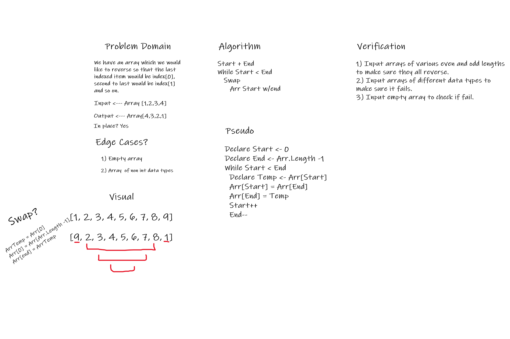

# Data Structures and Algorithms

# Language: `C#`

## Reverse an Array
Take an immutable array and reverse the values from start to end

## Whiteboard Process
- Created with Josh Haddock, Jona Brown, & Steven Boston
- We detailed a `problem domain` specifying the requirements of the challenge
- Then Made a `Visual` representation of the array value swapping
- Roughed out the steps for our `algorithm`
- Wrote out `Pseudo code` detailing in plain english our codes intended structure and behavior
- Outlined steps to `verify` our solution and test possible edge cases

## Approach & Efficiency
The approach would be to try and achieve this array-reverse solution with a linear method

