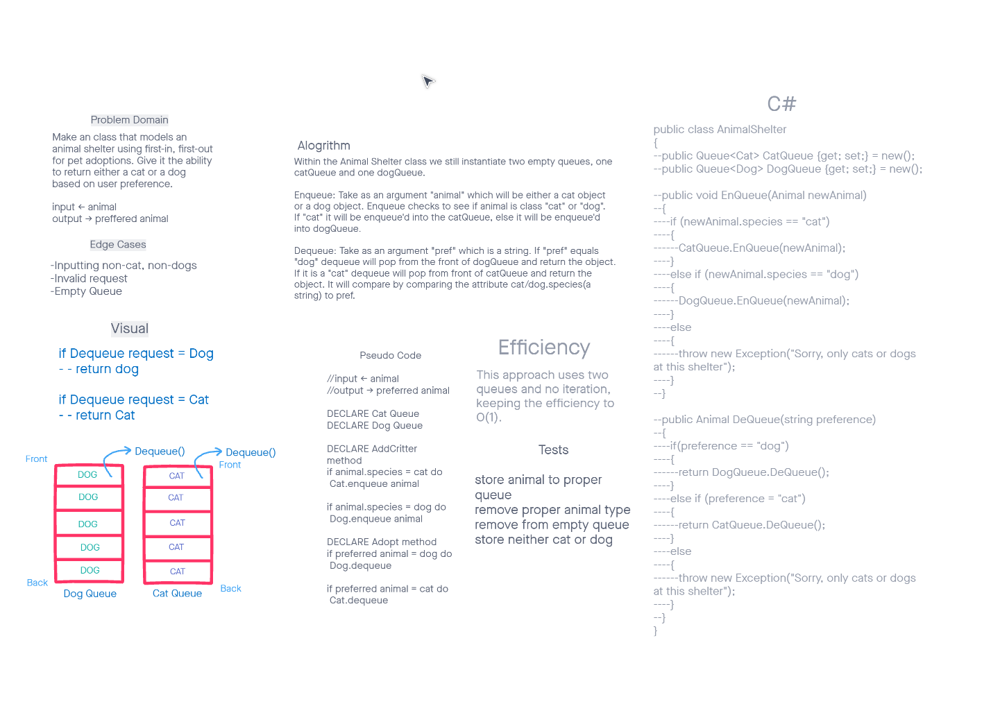

# stack-queue-animal-shelter

## Challenge
Make an class that models an animal shelter using first-in, first-out for pet adoptions. Give it the ability to return either a cat or a dog based on user preference.

## Approach & Efficiency
This approach uses two queues and no iteration, keeping the efficiency to O(1).

## WhiteBoard
