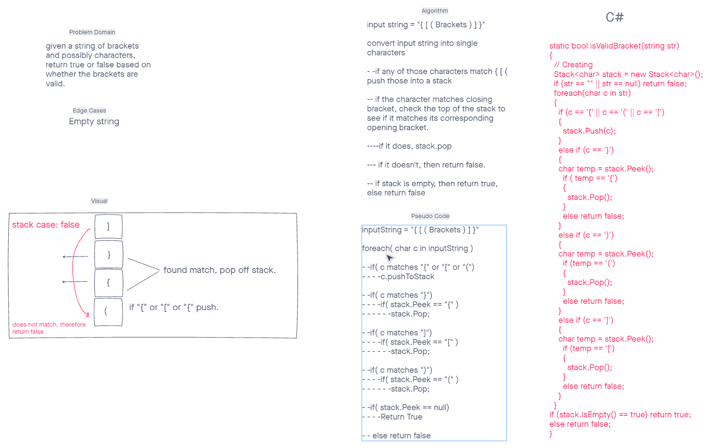

# stack-queue-brackets
CodeChallegne 13  

## Challenge
Given a string of brackets and characters, return true or false based on whether the brackets are valid.

## Approach & Efficiency
Method was written to check string linearly and verify as it checks input, O(1)

## WhiteBoard
