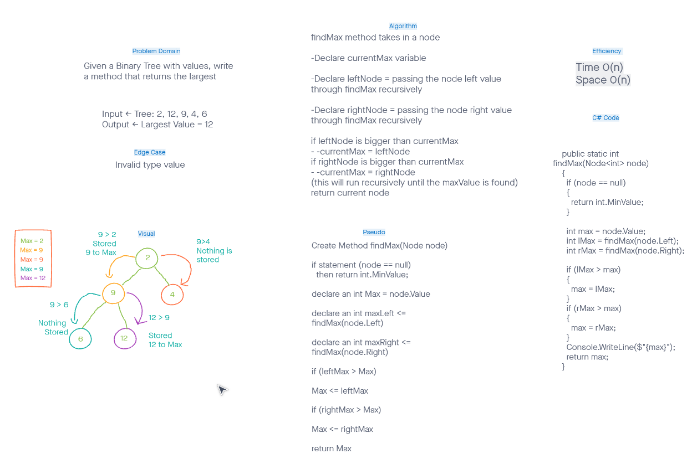

# trees
CodeChallegne 16  

## Challenge
Given a Binary Tree with values, write a method that returns the largest value in the tree

## Whiteboard

## Approach & Efficiency
Assigna variable to the value of the root of the tree, iterate over the tree recursively, check each nodes left and right value, if values are higher than the current stored Max value of the root, assign the new Max value to be the value of the current biggest node value. O(n)