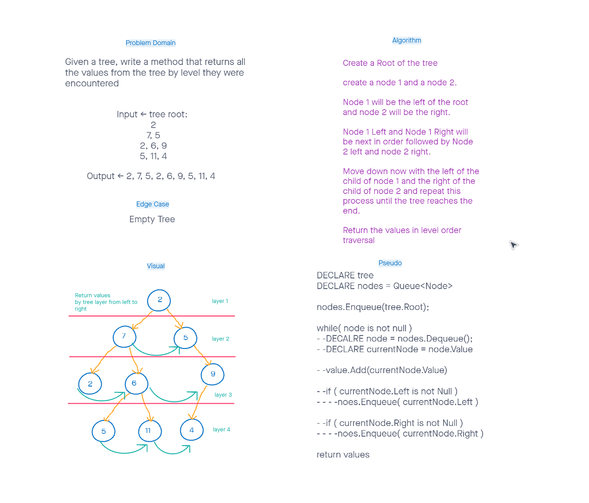

# trees
CodeChallegne 17  

## Challenge
Given a tree, write a method that returns all the values from the tree by level they were encountered

## Whiteboard

## Approach & Efficiency
- Create a Root of the tree
- Create a node 1 and a node 2
- Node 1 will be the left of the root and node 2 will be the right
- Node 1 Left and Node 1 Right will be next in order followed by Node 2 left and node 2 right
- Move down now with the left of the child of node 1 and the right of the child of node 2 and repeat this process until the tree reaches the end
- Return the values in level order traversal