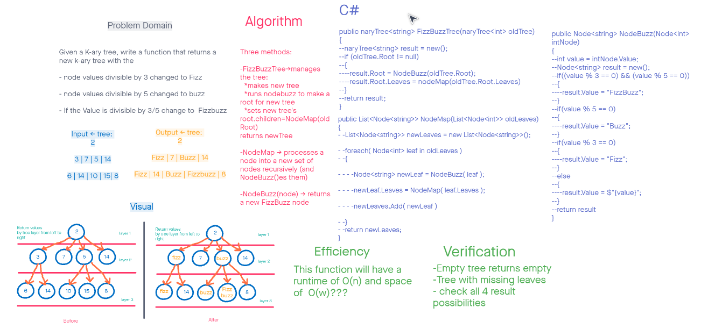

# trees
CodeChallegne 18  

## Challenge
Given a K-ary tree, write a function that returns a new k-ary tree with the
- node values divisible by 3 changed to Fizz
- node values divisible by 5 changed to buzz
- If the Value is divisible by 3/5 change to  Fizzbuzz 
- else return the value as string

## Whiteboard

## Approach & Efficiency
### Three methods:  
This function will have a runtime of O(n) and space of  O(w)???  

FizzBuzzTree -> manages the tree:  
- makes new tree
- runs nodebuzz to make a root for new tree
- sets new tree's root.children=NodeMap(oldRoot)
- returns newTree

NodeMap ->  
- processes a node into a new set of nodes
- recursively iterates (and NodeBuzz()es them)

NodeBuzz(node) ->  
- returns a new FizzBuzz node