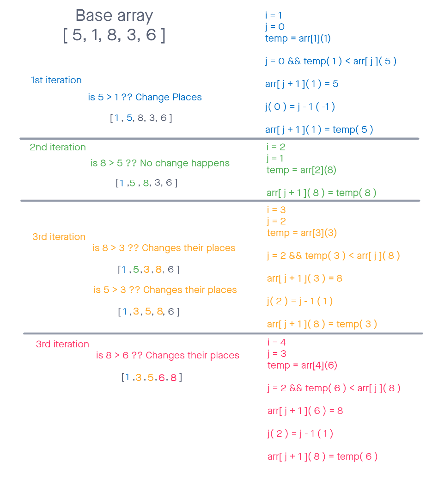

# trees
CodeChallenge 26  

## Blog Article
[Blog Example](./blog.md)  

## Challenge
Review the pseudo code below, then trace the algorithm by stepping through the process with the provided sample array. Document your explanation by creating a blog article that shows the step-by-step output after each iteration through some sort of visual.  

Once you are done with your article, code a working, tested implementation of Insertion Sort based on the pseudocode provided.

## Whiteboard

## Approach & Efficiency  
- Declare a temp variable, and assign it the value of index 0 + 1 (aka the value after 0 index)
- Compare the current value (0 index) to value just ahead of it (1 index)
- if/while the temp variable value is greater than the current value 
- If the temp value is larger than the next value, reassign values
- Current value is set to equal the Next Value
- Next Value is set to equal temp Value
- repeat until completely iterated through the array and sorted
