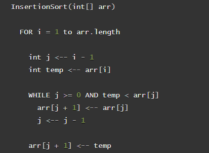

# Insertion Sort
### Take the example pseudo code below, and detail step by step the way in which it will iterate and sort an array of numbers

### In this example below we show the changes made in the array through highlight the numbers affected through that particular iteration. As additional details we write out the action taken by the algorithm when checking the numbers currently assigned to value of arr at [i] and array at [j]. It can be seen that the while loop continues until the numbers are in proper order.  
- Declare a temp variable, and assign it the value of index 0 + 1 (aka the value after 0 index)
- Compare the current value (0 index) to value just ahead of it (1 index)
- if/while the temp variable value is greater than the current value 
- If the temp value is larger than the next value, reassign values
- Current value is set to equal the Next Value
- Next Value is set to equal temp Value
- repeat until completly interated through the array and sorted

