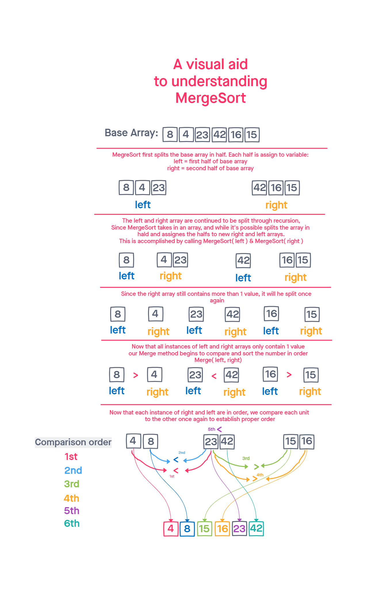

# Merge-Sort
CodeChallenge 27  
Benjamin Ibarra & Joshua Haddock

## Blog Article
[Blog Example](./blog.md)  

## Challenge
Review the pseudo code below, then trace the algorithm by stepping through the process with the provided sample array. Document your explanation by creating a blog article that shows the step-by-step output after each iteration through some sort of visual.  

Once you are done with your article, code a working, tested implementation of Insertion Sort based on the pseudocode provided.

```
ALGORITHM Mergesort(arr)
    DECLARE n <-- arr.length

    if n > 1
      DECLARE mid <-- n/2
      DECLARE left <-- arr[0...mid]
      DECLARE right <-- arr[mid...n]
      // sort the left side
      Mergesort(left)
      // sort the right side
      Mergesort(right)
      // merge the sorted left and right sides together
      Merge(left, right, arr)

ALGORITHM Merge(left, right, arr)
    DECLARE i <-- 0
    DECLARE j <-- 0
    DECLARE k <-- 0

    while i < left.length && j < right.length
        if left[i] <= right[j]
            arr[k] <-- left[i]
            i <-- i + 1
        else
            arr[k] <-- right[j]
            j <-- j + 1

        k <-- k + 1

    if i = left.length
       set remaining entries in arr to remaining values in right
    else
       set remaining entries in arr to remaining values in left
```

## Whiteboard


## Approach & Efficiency  
- MegreSort first splits the base array in half. Each half is assign to variable:
    - left = first half of base array
    - right = second half of base array
- The left and right array are continued to be split through recursion,
- Since MergeSort takes in an array, and while it's possible splits the array in hald and assignes the halfs to new right and left arrays.
- This is accomplished by calling MergeSort( left ) & MergeSort( right )
- Once all instances of left and right arrays only contain 1 value
- our Merge method begins to compare and sort the numbers in order, "Merge(left, right)"
- Now that each instance of right and left are in order, we compare each unit to the other once again to establish proper order, returning the final properly merged and ordered array