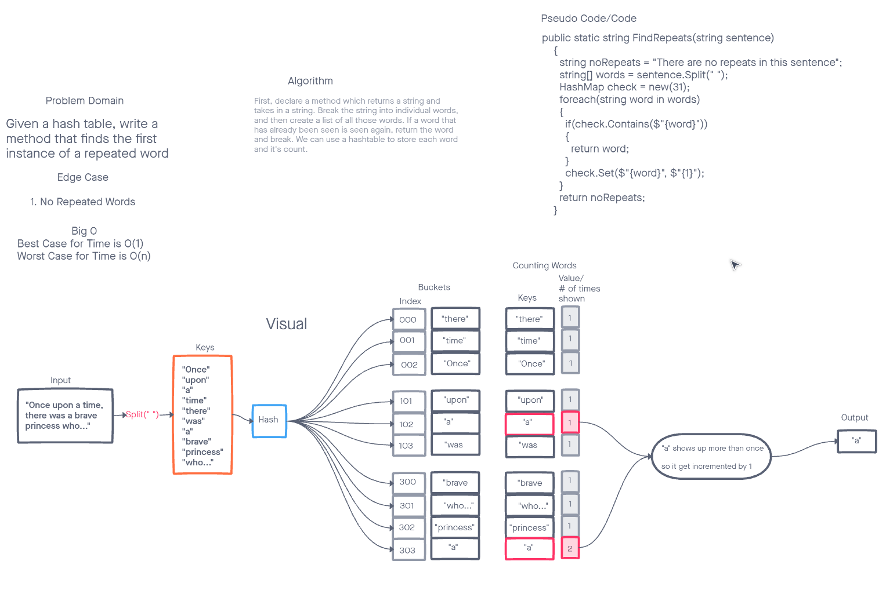

# Hash Maps
Benjamin Ibarra, Joshua Haddock, Qaalid Hashi

## Hashmap Repeated Word
Write a function called repeated word that finds the first word to occur more than once in a string  
Arguments: string  
Return: string

## Example
input: "Once upon a time, there was a brave princess who..."  
output: "a"

## process 
First, declare a method which returns a string and takes in a string. Break the string into individual words, and then create a list of all those words. If a word that has already been seen is seen again, return the word and break. We can use a hashtable to store each word and it's count. 

## WhiteBoard
