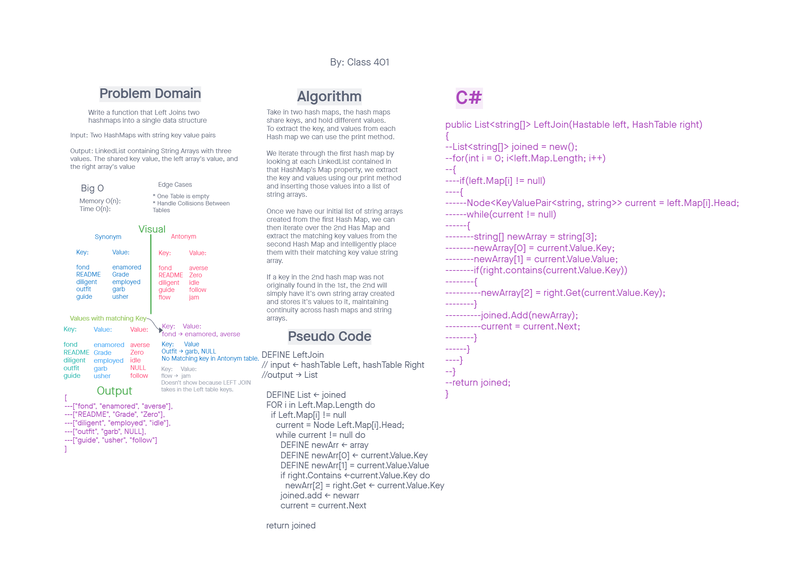

# Hash Maps
Benjamin Ibarra and all of 401 class colab.

## Hashmap Left Join
Write a function that LEFT JOINs two hashmaps into a single data structure.

Write a function called left join
Arguments: two hash maps
The first parameter is a hashmap that has word strings as keys, and a synonym of the key as values.
The second parameter is a hashmap that has word strings as keys, and antonyms of the key as values.
Return: The returned data structure that holds the results is up to you. It doesn’t need to exactly match the output below, so long as it achieves the LEFT JOIN logic

## Example
Input: Two HashMaps with string key value pairs  
Output: LinkedList containing String Arrays with three values. The shared key value, the left array's value, and the right array's value  

## process 
Take in two hash maps, the hash maps share keys, and hold different values. 
To extract the key, and values from each Hash map we can use the print method. 
We iterate through the first hash map by looking at each LinkedList contained in 
that HashMap's Map property, we extract the key and values using our print method 
and inserting those values into a list of string arrays.  

Once we have our initial list of string arrays created from the first Hash Map, we can
then iterate over the 2nd Has Map and extract the matching key values from the second Hash Map and intelligently place them with their matching key value string array.  

If a key in the 2nd hash map was not originally found in the 1st, the 2nd will simply have it's own string array created and stores it's values to it, maintaining continuity across hash maps and string arrays.  

## WhiteBoard
